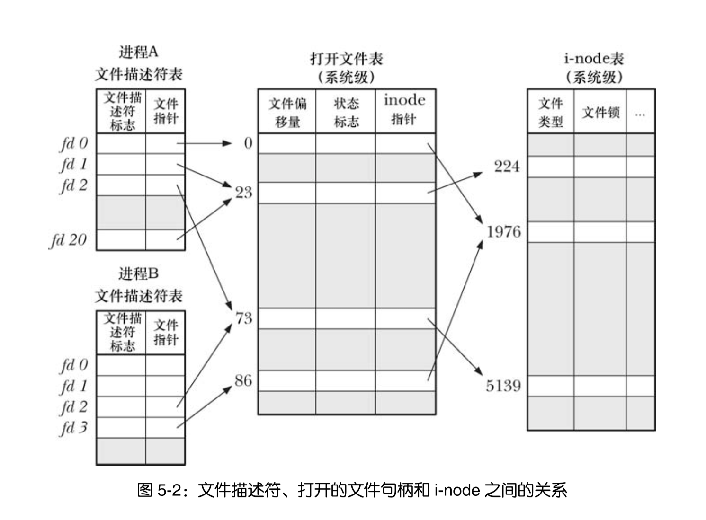

# IO

> TODO: epoll调用实例

```c
// 通用IO: 可以对所有文件类型执行IO操作

// 打开文件，返回文件描述符
// flag 设置文件权限
// 常用文件访问模式:
// O_RDONLY 只读
// O_WRONLY 只写
// O_RDWR   读写
// O_CREAT  文件若不存在便创建
// O_TRUNC  截断文件
// O_APPEND 文件追加写入
// O_EXCL   和O_CREAT标志结合，如果文件若存在则不创建
int open(const char* pathname, int flags, ...);

// 创建文件
int creat(const char* pathname, mode_t mode);

// read/write从内核缓冲区读入/写入用户缓冲区

// 读取文件
// 返回实际读取数，或者读到文件结束返回0，否则返回-1
ssize read(int fd, void* buffer, size_t count);

// 写入文件
// 返回写入字节数
ssize write(int fd, void* buffer, size_t count);

// 关闭文件
int close(int fd);
```

## 为文件内核维护的三个数据结构

> 进程级的文件描述表  
> 1.文件句柄的引用  
> 2.标志符用于控制文件描述符操作  
> 系统级的打开文件表  
> 1.当前文件偏移量  
> 2.打开文件时所用的状态标志 (ps: open的flags)    
> 3.文件访问模式
> 4.与信号驱动I/O相关的设置  
> 5.对inode的引用  
> 文件系统的inode表
> 1.文件类型和访问权限
> 2.指向文件锁列表的指针
> 3.文件各种属性等



## 标准I/O

> 原理：缓冲大块数据减少系统调用


```c
// 设置缓冲模式
// buf  为stream设定专门的用户缓冲区
// mode 参数
// _IOLNBF 无缓冲，每个标准io函数都直接调用
// _IOLBF  行缓冲，遇到换行符之前或者未填满缓冲区时将数据先放入缓冲区
// _IOFBF  全缓冲，未填满缓冲区时先将数据放入缓冲区
int setvbuf(FILE* stream, char* buf, int mode, size_t size);

// 强制刷新缓冲区
int fflush(FILE* stream);

// 控制文件I/O内核缓冲
// 将fd关联的数据全刷新到磁盘里
int fsync(int fd)
// 将更新的文件全部刷新到磁盘中
void sync(void)
```

## 高级I/O

> 水平触发：如果文件描述符可以非阻塞的执行I/O系统调用，则认为就绪  
> 边缘触发：如果文件描述符在上次检查状态之前有了新的I/O活动，则触发，且尽可能地多执行I/O


### IO多路复用

```c
// select 一直阻塞直到一个或多个文件描述符集合称为就绪态
int select(int nfds, fd_set* readfds, fd_set* writefds, fd_set* exceptfds, struct timeval* timeout);

// select相关宏
// 构造空集
void FD_ZERO(fd_set* fdset);
// 添加文件描述符到集合中
void FD_SET(int fd, fd_set* fdset);
// 删除文件描述符到集合中
void FD_CLR(int fd, fd_set* fdset);
// 判断文件描述符是否在集合中
int FD_ISSET(int fd, fd_set* fdset);

// poll()
int poll(struct pollfd fds[], nfds_t nfds, int timeout);

struct pollfd {
    int fd;
    short events;   /* 在fd上需要检查是否就绪的事件 */
    short revents;  /* 在fd上实际发生的事件 */
}
```

#### select()和poll()里文件描述符如何算就绪

> 对I/O函数的调用不会阻塞，注意就算数据是否可以传输也算就绪

### 信号驱动I/O

### epoll()

> ps: linux下特有

```c
// 创建epoll实例
int epoll_create(int size)

// 修改epoll的兴趣列表
int epoll_ctl(int epfd, int op, int fd, struct epoll_event* ev)

struct epoll_event {
    uint32_t events; /* 位掩码，用于指定该fd上感兴趣的事件集合 */
    epoll_data_t data; /* 给调用进程的信息 */
};

// epoll_data 定义
typedef union epoll_data{
    void *ptr;
    int fd;
    uint32_t u32;
    uint64_t u64;
} epoll_data_t;

// 返回多个就绪文件描述符的
// evlist 返回就绪描述符的信息
int epoll_wait(int efds, struct epoll_event* evlist, int maxevents, int timeout);
```

> epoll的水平触发和边缘触发的区别  
> 举例：  
> 假设我们使用epoll 来监视一个套接字上的输入（EPOLLIN），接下来会发生如下的事件  
> 1.套接字上有输入到来  
> 2.我们调用一次 epoll_wait()。无论我们采用的是水平发还是边缘触发通知，该调用都会告诉我们套接字已经处于就绪态了  
> 3.再次调用 epoll_wait()  
> 如果我们采用的是水平触发通知，那么第二个 epoll_wait()调用将告诉我们套接字处于就绪态。而如果我们采用边缘触发通知，那么第二个 epoll_wait()调用将阻塞，因为自从上一次调用 epoll_wait()以来并没有新的输入到来  
> 

> epoll的优势  
> 1.每次调用 select()和 poll()时，内核必须检查所有在调用中指定的文件描述符。与之相反，当通过 epoll_ctl()指定了需要监视的文件描述符时，内核会在与打开的文件描述上下文相关联的列表中记录该描述符。之后每当执行 I/O 操作使得文件描述符成为就绪态时，内核就在 epoll 描述符的就绪列表中添加一个元素。（单个打开的文件描述上下文中的一次 I/O 事件可能导致与之相关的多个文件描述符成为就绪态。）之后的epoll_wait()调用从就绪列表中简单地取出这些元素，**总之就是让内核为我们监视这些文件描述符**  
> 2.每次调用 select()或 poll()时，我们传递一个标记了所有待监视的文件描述符的数据结构给内核，调用返回时，内核将所有标记为就绪态的文件描述符的数据结构再传回给我们。与之相反，在 epoll 中我们使用 epoll_ctl()在内核空间中建立一个数据结构，该数据结构会将待监视的文件描述符都记录下来。一旦这个数据结构建立完成，稍后每次调用 epoll_wait()时就不需要再传递任何与文件描述符有关的信息给内核了，而调用返回的信息中只包含那些已经处于就绪态的描述符，**可以不用重复监视**